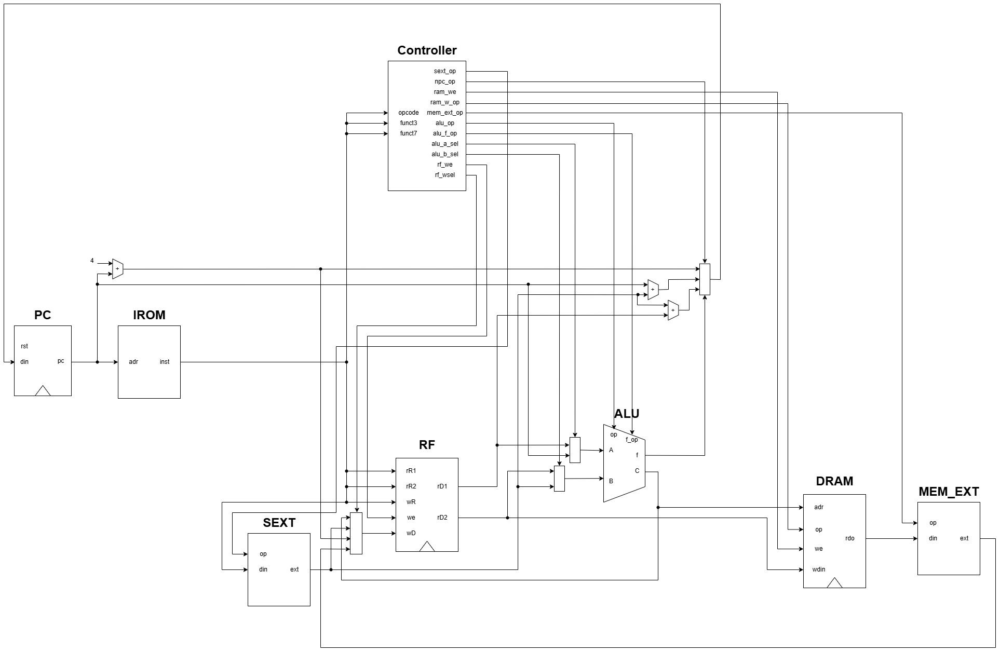
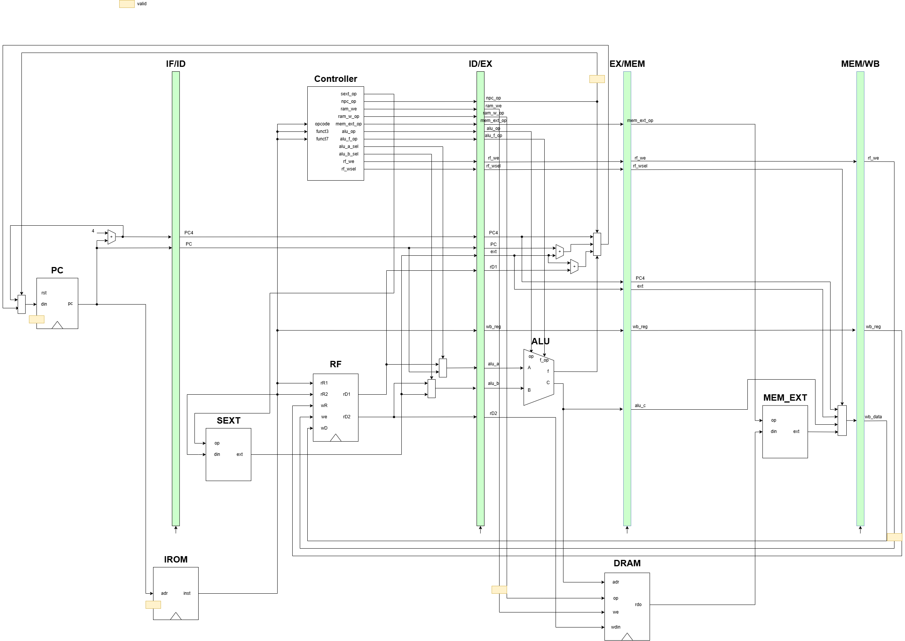
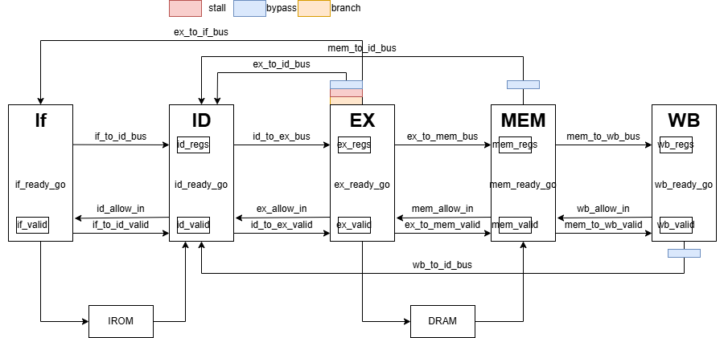

# RV32i CPU 单周期以及流水线实现

## 架构设计图

### 单周期

单周期CPU架构设计图

### 流水线

流水线CPU基本架构设计图

流水线CPU顶层架构设计图

注：

* 流水线CPU由于涉及到数据冒险和控制冒险的处理，基本架构仅供前期划分流水线参考，实际效果为顶层架构设计图所示

## 仿真测试

|汇编代码文件|机器码文件|功能描述|预期结果|单周期测试结果|流水线测试结果|
|:---:|:---:|:---:|:---:|:---:|:---:|
|[test_base.asm](./test/test_base.asm)|[test_base.hex](./test/test_base.hex)|测试不存在冒险和冲突的基本指令|[test_base.png](./docs/test_base.png)|✅|✅|
|[test_hazard_RAW.asm](./test/test_hazard_RAW.asm)|[test_hazard_RAW.hex](./test/test_hazard_RAW.hex)|测试冒险(主要为RAW)|[test_hazard_RAW.png](./docs/test_hazard_RAW.png) |✅|✅|
|[test_branch.asm](./test/test_branch.asm)|[test_branch.hex](./test/test_branch.hex)|测试跳转指令|[test_branch.png](./docs/test_branch.png)|✅|✅|
|[test_comprehensive.asm](./test/test_comprehensive.asm)|[test_comprehensive.hex](./test/test_comprehensive.hex)|综合测试(37条测试指令)|[test_comprehensive.png](./docs/test_comprehensive.png)|✅|✅|

注：

* 由于 `rars` 工具的原因，有关 pc 的部分代码写入寄存器的值相比于仿真的实际结果大 `0x00003000`

## 项目目录

|目录或文件|描述|
|:---:|:---:|
|`docs/`|存放图片|
|`pipelined/`|存放流水线CPU代码|
|`single_cycle/`|存放单周期CPU代码|
|`test/`|存放测试文件|
|`README.md`|项目说明文件|

## 参考视频和代码

* [[HIT COA] 32位流水线CPU的设计与实践——Verilog实现](https://www.bilibili.com/video/BV1xzBHYgE3c)
* [Project-Pipeline](https://github.com/FlyMachinee/project-pipeline)
* [Accomdemy RV32I CPU](https://github.com/accomdemy/accomdemy_rv32i)
